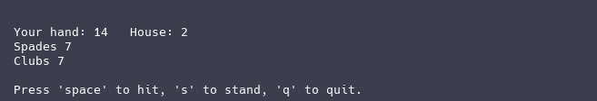

## Blackjack with bubbletea ♠️♣️♥️♦️

This is a simple implementation of the Blackjack card game using the Bubble Tea TUI framework in Go. The game allows you to play against a dealer, with options to hit and stand.

### Features

- Play against a dealer
- Simple command-line interface
- Basic game logic for Blackjack
- Replayability with a new shuffled deck each game

### Installation
To install the game, you need to have Go installed on your system. Then, you can clone the repository and run the game:

```bash
clone repository && go run .
```
or you can build the game and run the executable:

```bash
go build && ./blackjack
```

or just download from releases and run the executable.

### Gameplay
- The game starts with the player being dealth two cards and the dealer being dealt one card.
- The player can choose to "hit" (enter) to receive another card or "stand" (s) to end their turn.
- The dealer will then play according to standard Blackjack rules (hitting until they reach 17 or higher). WIP
- The game will determine the winner based on who has the higher hand value without exceeding 21


### Contributing
feel free to submit a pull request.

### Features to add
- Implement a score system to keep track of wins and losses
- Implement logic for Splitting
- Implement persitent storage to save player progress and scores
- Implement animations for card dealing and game actions
- Implement more pleasent UI (https://github.com/charmbracelet/lipgloss)
